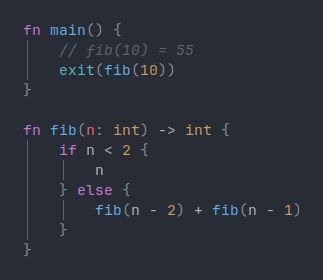

# The rush Programming Language

A simple programming language for researching different ways of program
execution and compilation.

> **Note:** Since this project is part of a research project, the language
> cannot be considered _production-ready_.

## Demo: Calculation of Fibonacci Numbers

## Projects Which Are Part of rush

### Paper

Since rush was initiated due to a research project about compiler construction
and different means of program execution, all important concepts are explained
in the rush paper. The project and the paper were developed by
[Mik Müller](https://github.com/MikMuellerDev) and
[Silas Groh](https://github.com/RubixDev) at the _CFG Wuppertal_.

An up-to-date version of the rush paper can be viewed at
[this url](https://paper.rush-lang.de). Additionally, the source code and commit
history of paper can be found at the below git repository.

- [Paper Source Code](https://github.com/rush-rs/paper)

### Program Analysis

- [Lexer & Parser](https://github.com/rush-rs/rush/tree/main/crates/rush-parser)
- [Semantic Analyzer](https://github.com/rush-rs/rush/tree/main/crates/rush-analyzer)

### Interpreters

- [Tree-walking Interpreter](https://github.com/rush-rs/rush/tree/main/crates/rush-interpreter-tree)
- [Virtual Machine Interpreter](https://github.com/rush-rs/rush/tree/main/crates/rush-interpreter-vm)

### Compilers

- [WASM Compiler](https://github.com/rush-rs/rush/tree/main/crates/rush-compiler-wasm)
- [LLVM Compiler](https://github.com/rush-rs/rush/tree/main/crates/rush-compiler-llvm)
- [RISC-V Compiler](https://github.com/rush-rs/rush/tree/main/crates/rush-compiler-risc-v)
- [x86_64 Compiler](https://github.com/rush-rs/rush/tree/main/crates/rush-compiler-x86-64)

### Transpilers

- [ANSI C Transpiler](https://github.com/rush-rs/rush/tree/main/crates/rush-transpiler-c)

### Tools & Additional Software

- [Language Server](https://github.com/rush-rs/rush/tree/main/crates/rush-ls)
- [rush CLI](https://github.com/rush-rs/rush/tree/main/crates/rush-cli)
- [tree-sitter grammar](https://github.com/rush-rs/tree-sitter-rush)
- [Codemirror grammar](https://github.com/rush-rs/codemirror-lang-rush)
- [playground source code](https://github.com/rush-rs/playground)

## Additional Links & Resources

- [Rush Website](https://rush-lang.de)
- [Rush Playground](https://play.rush-lang.de)
- [Rush Paper](https://paper.rush-lang.de)
- [Sample Files & Tests](https://github.com/rush-rs/rush/tree/main/samples/tests)
